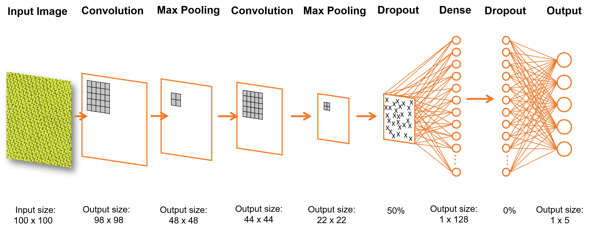

# WhichStitch
#### The world's first knitting stitch classifier!

### Why is it needed?
Since the creation of knitting hundreds of years ago, the artform has grown from one basic stitch to many hundreds. Through printed books and online libraries, knitters have attempted to index these various stitches in an easy and readable format. Most of these resources, however, rely on knowing the name of the desired stitch. Finding a stitch (along with directions to create it) without its name is no easy task, and most often results in a futile quest through pages of poorly photographed stitch patterns. With the rise of computer vision and neural networks in computer science, I became interested in imposing this new technology on knitting stitches. Now, instead of clicking through hundreds of images with glazed eyes and a slight headache, finding the name of a stitch can be as easy as taking a photo.

### What does it do?
The WhichStitch classifier is a mobile-friendly application hosted on Heroku that aims to classify images of stitches. The user uploads a photo to the application which is then sent to a pre-trained model. As of now, the app is only trained for **5 types of stitches** (garter, stockinette, seed, star, and slipstitch honeycomb). The model then will predict the most likely stitch from the uploaded image and display the result to the user. Future desired features include:
- text or video instructions to create the stitch
- next two most likely stitches
- similar stitches
- ability to add photos to the database

### How does it work?
The model itself was created in Keras, a user-friendly python library that sits on top of Tensorflow. A convolutional neural network (CNN) architecture was used as this type of neural network allows the model to learn patterns of pixels in the input images. Although many different CNN architectures exist, the one that achieved the highest accuracy consisted of two convolution layers with a max pooling layer after each. This was then flattened into a 1 x 128 dense layer which was then fully connected to an output layer of size 1 x 5. Dropout layers were introduced before and after the dense layer to attempt to prevent overfitting. To determine an architecture that gives the highest accuracy on the set of 2250 stitch images, the model was trained on over 1000 different parameters. The best model achieved an accuracy of ~85%. A visual representation thereof can be seen below.

For those who are not familiar with convolutional neural networks (or neural networks in general, for that matter), I will attempt to explain the general ideas. From the above architecture, we can see that the model takes a 100 x 100 image as input. The first layer that the image reaches is called a "convolutional layer". This layer consists of a *kernel size*, a *stride length*, and the number of *convolution filters*. The model here has a kernel size of 5 x 5, a stride length of 1, and 32 convolution filters. The convolution layer works by moving the kernel over the entire image, shifting the kernel by 1 each time (hence why stride = 1). In the below GIF, we see a simplified example. The kernel is the yellow 3 x 3 area, the stride length is 1, and the input image size is 6 x 6. We see that the resulting convolved output image is *smaller* than the original image. Thus we can take a large image and reduce it in size, picking out specific features with the kernel. 

Those already familiar with neural networks know about weights. Weights are the values that the model learns as it is trained. For training to occur in a convolutional neural network, two things must take place: forward propagation and backwards propagation. Forward propagation is the series of steps from the input image to the output prediction (move from left to right in the architecture picture above). Once we have the expected predictions, backpropagations compares the models prediction to the actual classification. This error is then *propagated* backwards through the model where the weights are changed (move from right to left in the architecture picture). Propagating forwards and backwards once constitutes an *epoch*. This process is repeated for many epochs until the weights no longer change or the error is small enough. 

### The Bug-Catching
Although there are hundreds of stitches available and this model only focuses of five of the more well-known stitches, it was still a sufficiently difficult project to tackle. From collecting (and cropping/resizing) over 2000 images to training the model to learning about Keras and convolutional neural networks in general, there was always some part of the project that could be improved. And finally, in the last week of the semester, I spent many hours digging through pages of StackOverflow to learn the fundamentals of Flask, Ajax calls, and JQuery so I could create a working model that can classify an uploaded image in a matter of seconds. After the tedious process of figuring out how to "post" an image, retrieve it in Python, use the prediction function on a saved model, and return the results to redirect the user to a new page, the minimum viable product is available for you to try. Originially I had planned on a 3-stitch classification network with an accuracy of at least 75%. Surpassing both of these points, the current model consists of a 5-stitch classification CNN with an accuracy of 85%. Although this accuracy still leaves room for error, the model performs quite well for many of the uploaded images I have tested. 

The overall goal is to make this application mobile-friendly so smartphone users can take a picture of a stitch and receive a prediction in real-time. Optimizing a website for mobile viewing, however, is slightly more difficult than I had previously expected. (Along with, at the time of writing this, there seems to be a bug where the mobile version classifies every stitch as seed stitch...) Nevertheless, the main idea is implemented in the functioning desktop version.  

### Demo
Alright! I know you all are itching to try this out. So grab your phone and your favorite knitted sweater and [give it a try!](http://whichstitch.herokuapp.com) Or just check out the demo below:

